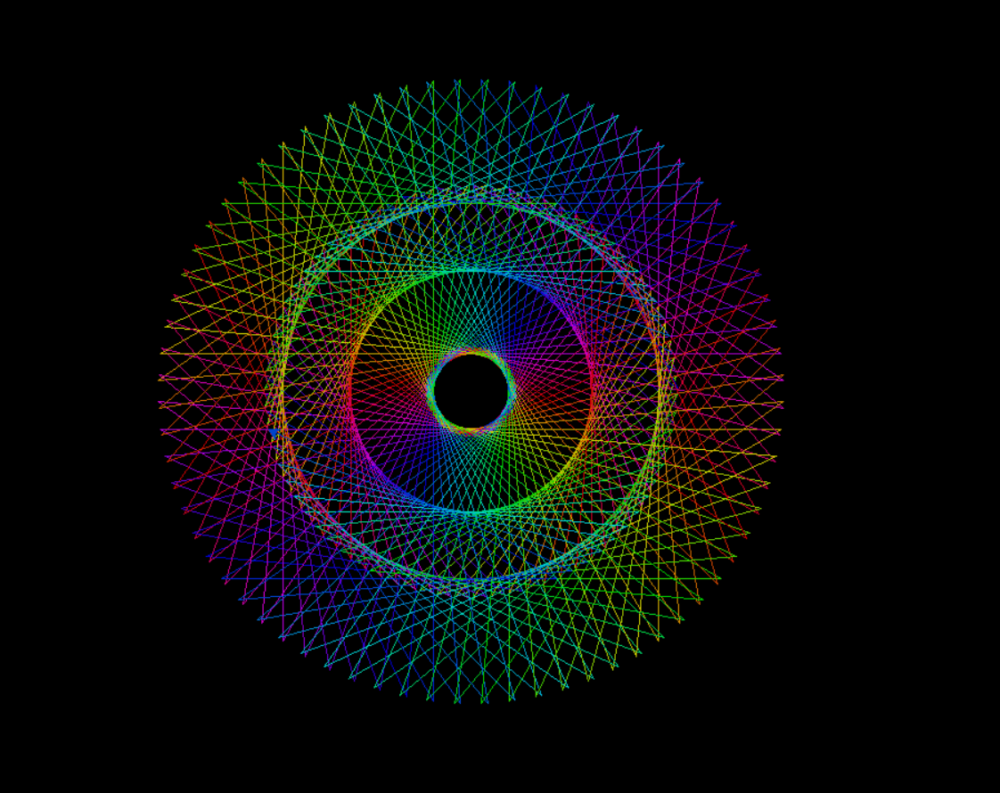

# Spiral Design - Py4Fun Repository

Welcome to the **Spiral Design** folder, a part of the Py4Fun repository! Here, you'll find a variety of Python code examples that allow you to create mesmerizing spiral designs. Each example demonstrates a unique approach to generating spirals, showcasing the playful and artistic side of Python programming.

## Table of Contents

1. [Introduction](#introduction)
2. [Spiral Types](#spiral-types)
3. [Getting Started](#getting-started)
4. [Day 1: Color Spiral](#day-1-color-spiral)
5. [Contributing](#contributing)
6. [License](#license)

## Introduction

The Spiral Design folder is a collection of Python scripts that leverage mathematical concepts to produce captivating spiral patterns. Whether you're a coding enthusiast, an artist, or simply curious about the creative potential of Python, these spirals are sure to inspire and delight.

## Spiral Types

Explore a variety of spiral types that you can generate using Python code within this folder:

- Archimedean Spirals
- Fermat's Spirals
- Logarithmic Spirals
- Hyperbolic Spirals
- and more...

## Getting Started

To get started with creating your own spiral designs, follow these simple steps:

1. Clone the Py4Fun repository to your local machine:

   ```bash
   git clone https://github.com/bluntlycoded/Py4Fun.git
   ```

2. Navigate to the **Spiral Design** folder:

   ```bash
   cd Py4Fun/Spiral\ Design
   ```

3. Browse through the various subfolders to find Python scripts for different spiral types.

## Day 1: Color Spiral

**Color Spiral** is a Python script that generates a visually appealing spiral pattern with vibrant colors. Take a look at the screenshot below:



To run the **Color Spiral** script, execute the following command:

```bash
python color_spiral.py
```

Feel free to experiment with the code, tweak the parameters, and observe how it affects the appearance of the spiral.

## Contributing

Contributions to the Spiral Design folder are welcome! If you have a new spiral pattern to share or an improvement to an existing one, please consider contributing:

1. Fork the Py4Fun repository.

2. Create a new branch for your contribution:

   ```bash
   git checkout -b feature/add-spiral
   ```

3. Add your Python script(s) to the appropriate subfolder.

4. Commit your changes:

   ```bash
   git commit -m "Add: [Description of Your Spiral]"
   ```

5. Push your changes to your forked repository:

   ```bash
   git push origin feature/add-spiral
   ```

6. Open a pull request to the main Py4Fun repository.

## License

This folder is part of the Py4Fun repository and is licensed under the [MIT License](../LICENSE). You are encouraged to use, modify, and distribute the code for educational and personal purposes. Please review the complete license terms in the main repository's `LICENSE` file.

Let your creativity flow with Python spirals, and enjoy the artistic journey!

---
